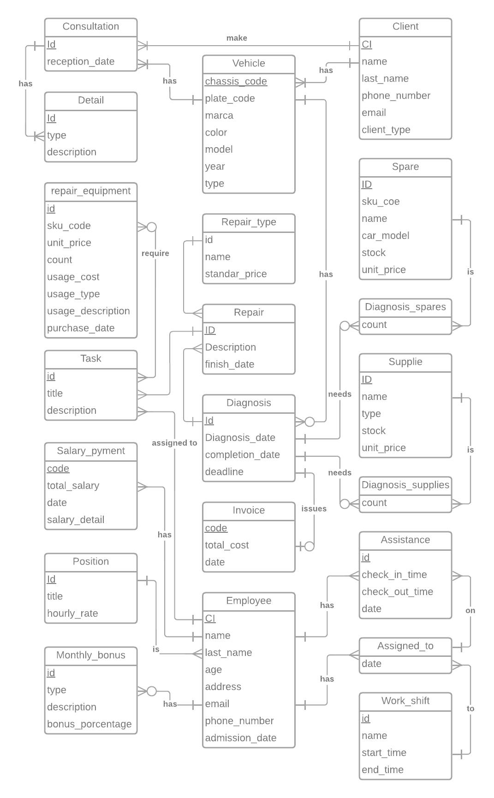

---
output:
  pdf_document:
    latex_engine: xelatex
mainfont: Times New Roman
---

# Car Services

## **Introduccón**

**Car Service**, es una empresa ÉPICA de mecánica automotriz realizan todo tipo de reparaciones y mantenimiento que tu vehículo necesita; con tecnología de punta. Sin embargo debido a la creciente popularidad de la empresa están emergiendo diversos problemas de administración ya que todo se realiza mediante notas en el cuaderno lo cual se hace una tarea cada vez más tediosa de hacer a tal punto que en muchas ocasiones se pierde información histórica lo cual deriva en una mala gestión de ingresos y egresos o un mal cálculo de los costos.

Debido a todo los problemas mencionados anteriormente esta empresa decidió contratar nuestros increíbles servicios para crear una base de datos con la que Car Service administre todo el negocio.

## **Modelo Entidad-Relacion**

## **Modelo relacional**

- **Vehicle**(<u style="color: red">chassis_code</u>, plate_code, brand, color, model, year, type, <u style="text-decoration:underline dotted">client_id</u>)
- **client**(<u style="color: red">CI</u>, name, last_name, phone_number, email, client_type)
- **Consultation**(<u style="color: red">id</u>, reception_date <u style="text-decoration:underline dotted">client_id</u>, <u style="text-decoration:underline dotted">vehicle_id</u>)
- **Detail**(<u style="color: red">id</u>, type, description, <u style="text-decoration:underline dotted">consultation_id</u>)
- **Diagnosis**(<u style="color: red">id</u>, diagnosis_date, completion_date, <u style="text-decoration:underline dotted">vehicle_id</u>)
- **Repair_type**(<u style="color: red">id</u>, name, standar_price)
- **Repair**(<u style="color: red">id</u>, description, finish_date, <u style="text-decoration:underline dotted">repair_type_id</u>, <u style="text-decoration:underline dotted">diagnosis_id</u>)
- **Invoice**(<u style="color: red">code</u>, total_cost, date, <u style="text-decoration:underline dotted">diagnosis_id</u>)
- **Diagnosis_spare**(<u style="text-decoration:underline dotted">diagnosis_id</u>, <u style="text-decoration:underline dotted">spare_id</u>, count)
- **Spare**(<u style="color: red">id</u>, sku_code, name, car_model, stock, unit_price)
- **Diagnosis_supplies**(<u style="text-decoration:underline dotted">diagnosis_id</u>, <u style="text-decoration:underline dotted">supplie_id</u>, counts)
- **Supplie**(<u style="color: red">id</u>, sku_code, name, type, stck, unit_price)
- **Task**(<u style="color: red">id</u>, title, description, <u style="text-decoration:underline dotted">diagnosis_id</u>, <u style="text-decoration:underline dotted">employee_id</u>)
- **Repair_equipment**(<u style="color: red">id</u>, sku_code, unit_price, count, usage_cost, usage_type, usage_description, purchase_date)
- **Repair_equipment_task**(<u style="text-decoration:underline dotted">task_id</u>, <u style="text-decoration:underline dotted">repair_equipment_id</u>)
- **Employee**(<u style="color: red">CI</u>, name, last_name, age, address, email, phone_number, admission_date, <u style="text-decoration:underline dotted">position_id</u>)
- **Position**(<u style="color: red">id</u>, title, hourly_rate)
- **Monthly_bonus**(<u style="color: red">id</u>, type, description, bonus_porcentage, <u style="text-decoration:underline dotted">employee_id</u>)
- **Workshift**(<u style="color: red">id</u>, name, start_time, end_time)
- **Assigned_to**(<u style="text-decoration:underline dotted">employee_id</u>, <u style="text-decoration:underline dotted">workshift_id</u>, date)
- **Assistance**(<u style="color: red">id</u>, checkin_time, checkout_time, date, <u style="text-decoration:underline dotted">employee_id</u>, <u style="text-decoration:underline dotted">assigned_to_id</u>)
- **Salary_payment**(<u style="color: red">id</u>, total_salary, date, salary_detail, <u style="text-decoration:underline dotted">employee_id</u>)
